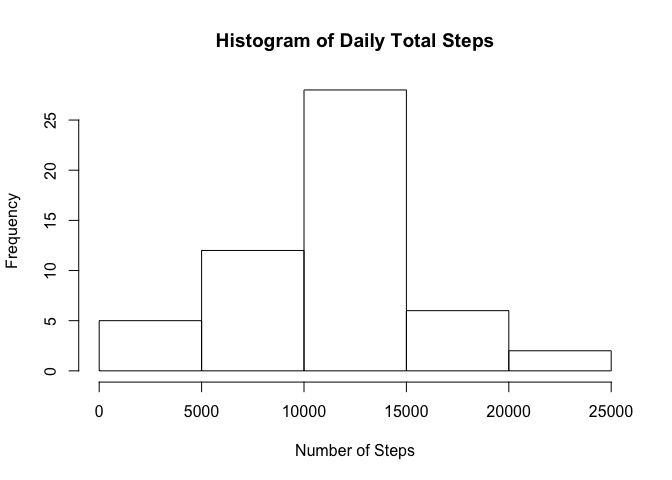

# Reproducible Research: Peer Assessment 1


## Loading and preprocessing the data

```r
#load the data
data<-read.csv(unz("activity.zip","activity.csv"))
#sum steps, grouping by day 
sumSteps<-aggregate(data$steps,by=list(data$date),FUN=sum)
```

## What is mean total number of steps taken per day?

```r
#plot a histogram showing frequency of number of steps
hist(sumSteps$x,xlab="Number of Steps",main="Histogram of Daily Total Steps")
```

<!-- -->

```r
#calculate mean in the summed steps data
myMean<-mean(sumSteps$x,na.rm=TRUE)
#calculate median in the summed steps data
myMedian<-median(sumSteps$x,na.rm=TRUE)
```
The **mean** total daily steps is 10766.19  
The **median** total daily steps is 10765


## What is the average daily activity pattern?

```r
#calculate the mean number of steps for each interval
meanDaily<-aggregate(data$steps,by=list(data$interval),FUN=mean, na.rm=TRUE)
#set column names of this table
colnames(meanDaily)<-c("interval","mean_steps")
#plot average daily pattern
plot(meanDaily$interval,meanDaily$mean_steps,type="l",main="Average Daily Pattern",xlab="interval",ylab="average steps")
```

<!-- -->

```r
#get the interval with max number of steps
maxstepinterval<-subset(meanDaily,meanDaily$mean_steps==max(meanDaily$mean_steps))$interval
```
The interval with maximum number of steps is 835


## Imputing missing values

```r
#count number of NA records
numNa<-sum(is.na(data$steps))
```
The number of NA records in the data is 2304

The strategy I'll use to impute missing values is to replace the NA step entries with the mean value for that time interval as calculated when analysing the dataset in the absence of NA values. The code for doing so is shown below:

```r
dataPrime<-data #copy data
naIndices<-with(dataPrime,is.na(dataPrime$steps)) #get all NA indices
for (i in 1:length(naIndices))
{
    if (naIndices[i]) #if this index is NA, do replacement logic
    {
        #find mean associated with this interval
        meanForInterval <- meanDaily[meanDaily$interval==dataPrime$interval[i],c("mean_steps")]
        #replace value with mean
        dataPrime$steps[i]<-meanForInterval
    }
}
#on this new data set, sum up the number of steps, grouping by day
sumStepsPrime<-aggregate(dataPrime$steps,by=list(dataPrime$date),FUN=sum)
#plot a histogram of the daily total steps on new data set
hist(sumStepsPrime$x,xlab="Number of Steps",main="Histogram of Daily Total Steps")
```

<!-- -->


```r
#get mean of data set with injected values for NA
myMeanPrime<-mean(sumStepsPrime$x,na.rm=TRUE)
#get median of data set with injected values for NA
myMedianPrime<-median(sumStepsPrime$x,na.rm=TRUE)
```
The **mean** total daily steps of patched data set is 10766.19.  
Compare this to the **mean** of total daily steps of non-patched data set: 10766.19  
  
The **median** total daily steps of patched data set is 10766.19  
Compare this to **median** of total daily steps of non-patched data set: 10765  
 
## Are there differences in activity patterns between weekdays and weekends?

```r
#get the weekday of each date in a vector
weekdayValues<-weekdays(as.Date(dataPrime$date),abbrev=TRUE)
#create new column for dataPrime that indicates whether it's a weekend or weekday as a factor
dataPrime$category<-ifelse(weekdayValues == "Sat" | weekdayValues == "Sun","weekend","weekday")
dataPrime$category<-as.factor(dataPrime$category)

#calculate the mean value of steps taken grouped by interval and category
meanDailyPrime<-aggregate(dataPrime$steps,by=list(dataPrime$interval,dataPrime$category),FUN=mean, na.rm=TRUE)
#set column names
colnames(meanDailyPrime)<-c("interval","category","mean_steps")
#plot weekend vs weekday for average activity pattern using a lattice line plot
library(lattice)
myPlot<-xyplot(mean_steps~interval|category, meanDailyPrime, main="Average Activity Pattern", ylab="Average Daily Steps", xlab="Interval", type="l")
update(myPlot,layout=c(1,2))
```

<!-- -->
